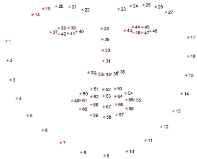

# Head Left/Right Turn Identification and Counting
This project involves identifying and counting left/right head turns of a human in a video stream using DLib library's pre-trained facial landmark detector. 

Facial landmarks are used to identify the following salient regions of the face:
- Eyes
- Eyebrows
- Nose
- Mouth
- Jawline

Detecting facial landmarks is a two step process:
1. Localize the face in the image
2. Detect the key facial structures on the face ROI

The pre-trained facial landmark detector inside the dlib library is used to estimate the location of 68 (x, y)-coordinates that map to facial structures on the face.

The indexes of the 68 coordinates can be visualized on the image below:

The facial landmark detector model can be downloaded [here](http://dlib.net/files/shape_predictor_68_face_landmarks.dat.bz2).

Once we have the model, we:
1. Iterate through the frames in the video stream
2. Run the face detector on each frame to capture the face(s) within it
3. Run the facial landmark detector model on each of the detected faces
4. Compute the ratio of the distances between the coordinates 1 and 29, and 17 and 29. If this ratio is lesser than a certain threshold, we identify the frame under consideration as one where a left/right head turn has been observed. 

For a head turn to be recorded, we need to observe more than a minimum threshold of consecutive frames over which a turn has been recorded.
